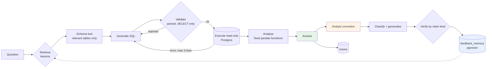

# Self-Improving Data Analyst Agent

An AI data analyst that answers business questions with SQL, and gets better
at it by remembering corrections from humans — **without the underlying model
ever being retrained.**

The interesting part is not the retrieval. It is what happens when the memory
is written by a fallible human.

**Status.** The agent, feedback classifier, verification, conflict detection,
memory, Learning Lab, HTTP API and benchmark harness are all built. The
benchmark has not yet been *run*, so no results are reported — see
[what's left](#whats-left).

---

## The problem

An LLM data agent makes the same mistake forever. Correct it today and
tomorrow it starts from zero, because nothing it learned persists. Fine-tuning
on corrections is slow, expensive, and hard to undo when a correction turns
out to be wrong.

The usual fix is to put corrections in a vector database and retrieve them
later. That is where most implementations stop, and it quietly introduces a
worse problem: **the memory now trusts whatever anyone typed into it.** An
analyst who is half-remembering, overgeneralising, or simply mistaken writes a
lesson that the agent will apply confidently for the rest of its life.

## The approach

A correction goes through a pipeline before it is allowed to influence
anything:

```
analyst correction
      │
      ├─ classify        what kind of mistake was this?
      ├─ generalise      rewrite it so it applies to future questions
      ├─ split claims    which parts are facts, causes, or conventions?
      ├─ verify          check each part the way that kind can be checked
      ├─ detect conflict does it contradict something already stored?
      └─ store           with status, confidence and provenance
                │
                └─ retrieved on future questions, as evidence that
                   the agent is explicitly allowed to disagree with
```

The key insight is that **most useful feedback is not a factual claim**, so
"verify it against the data" is not one operation but three:

| The analyst says | How it can be checked | Can it be rejected? |
|---|---|---|
| *"Refunds jumped in March"* | Run SQL, compare the numbers | Yes — if they didn't |
| *"Refunds caused the decline"* | Measure how much they explain. For "always" claims, search for a counterexample | Yes — one counterexample refutes "always" |
| *"Rank customers by spend, not ID"* | Is it executable? Does it change the answer? Does it conflict with a stored rule? | Yes — if it names columns that don't exist |

A system that stamps "verified" on all three is rubber-stamping.

## Architecture



Detailed diagrams of the retrieval ranking and the verification routes are in
[docs/memory-flow.md](docs/memory-flow.md).

## The three systems being compared

All three run an identical pipeline. **Only the retrieval filter differs**, so
any score difference comes from the memory rather than from a prompt someone
edited.

| | Retrieves | Why it exists | Built |
|---|---|---|---|
| **1. Baseline** | nothing | The control | yes |
| **2. Feedback RAG** | any stored lesson | The naive version — it cannot refuse an unchecked lesson | yes |
| **3. Verified feedback** | VERIFIED only, re-ranked by confidence | Should resist a poisoned memory | yes |

System 2 deliberately gets **no** verification signal at all: it retrieves
every status including REJECTED and ranks on raw similarity. If it filtered
rejected lessons out it would inherit the protection System 3 is meant to
provide, both systems would behave identically under a poisoned memory, and
the comparison would measure nothing.

## Tech stack

- **Python 3.13**
- **Postgres 16 + pgvector** — business data and vector memory in one database
- **Ollama** (local inference) with **Gemini** available behind an env switch
- **sqlglot** — SQL parsed into a syntax tree for validation
- **pandas / numpy** — a fixed library of analysis functions
- **LangGraph** — the agent control flow as an explicit state machine
- **FastAPI** + **Pydantic** — the HTTP API, settings and validation
- **Streamlit** — the Learning Lab
- **pytest** — 77 offline tests, run in CI
- **Docker Compose** — Postgres and pgAdmin

## Safety

The agent writes its own SQL, so there are two independent layers:

1. **Parse and inspect.** One statement, SELECT only, business tables only, no
   filesystem functions. 22 attack cases are covered by tests.
2. **A read-only database role.** Its transactions are read-only at the engine
   level, so a statement that somehow passed layer 1 still cannot write. It
   also has no access to the `memory` schema, which means agent SQL cannot
   read stored feedback — including rejected lessons.

Layer 1 can have a bug. Layer 2 cannot be argued with.

## The dataset

A fictional retailer, **Lumen & Co.** — 12 months, 12,000 customers, ~90,000
orders, ~265,000 rows. Fully synthetic and regenerated byte-identically from a
seed.

The data is built around a causal story the agent has to uncover: a courier
change causes late deliveries, which cause support tickets, which become
refunds, which damage reputation, which cuts order volume, which drops
revenue. Separately, a later month has revenue falling with refunds flat —
that month exists specifically so a universal claim about refunds can be
refuted.

It also contains six deliberate traps, each measured to be material: order
statuses that inflate revenue if unfiltered, gross-versus-net revenue, refund
dates that lag order dates across month boundaries, list price versus price
paid, NULL countries that silently drop rows, and margins that require the
cost column.

**The traps are the point.** A spotless dataset would give the agent nothing to
get wrong, and therefore nothing for an analyst to correct.

Ground truth is **measured out of the loaded database**, never copied from the
intended values, because noise moves the realised numbers. `make
verify-effects` fails loudly if any planted effect or trap stops being
material.

## Getting started

Requires Docker (or Colima), Python 3.11+, and [Ollama](https://ollama.com).

```bash
cp .env.example .env     # then set a password; no API key needed for local
make setup               # venv + dependencies
make llm-models          # pull the local chat and embedding models
make up                  # start Postgres, pgAdmin and Ollama
make verify              # assert the whole stack, including the safety layers
make seed                # generate, load and verify the dataset
make ui                  # the Learning Lab at localhost:8501
```

`make help` lists everything.

To run the experiment:

```bash
make snapshots           # build the clean / poisoned / mixed memories
make benchmark ARGS="--quick"   # smoke test, 3 questions per condition
make benchmark           # the real run; takes a few hours locally
```

Results land in `benchmark/results/` as raw runs, a summary and a markdown
table.

## Using the Learning Lab

1. Ask *"Why did revenue decrease in March 2026?"* The answer will be weak.
2. Open the SQL to see why — it looks at March alone and never joins refunds.
3. Type a correction: *"Compare March to February, and check refunds too."*
4. Watch it become a reusable lesson.
5. Ask *"What were the main drivers of the March 2026 revenue decline?"* —
   different wording, same topic. The lesson should return and change the SQL.

Then try giving it something **false** and watch what happens. Today it will
believe you, because verification is not built yet. That failure is much
easier to understand after seeing it.

## Repository layout

```
app/
  config.py            settings, provider switch
  llm.py               the only place a model is called
  agent/               state, prompts, baseline pipeline, runner
  tools/               schema, SQL validation+execution, analysis
  feedback/            classifier, memory store and retrieval
  observability/       trace storage
  database/            connections and schema DDL
data/
  effects_manifest.yml the experiment design
scripts/               setup, generation, loading, verification
tests/                 SQL validation suite
ui/                    the Learning Lab
docs/                  memory and verification diagrams
```

The model is never retrained. What improves is **what ends up in its prompt**:
a persistent, verified, human-authored memory that is retrieved and re-ranked
per question, and that the agent is explicitly allowed to disagree with.

## What's left

- Running the benchmark and reporting the measured results
- Failure analysis from those runs
- Validating the LangGraph engine against the sequential one, then making it
  the default (`AGENT_ENGINE`)
- A hosted data and trace explorer
