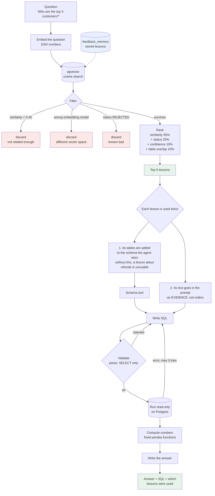
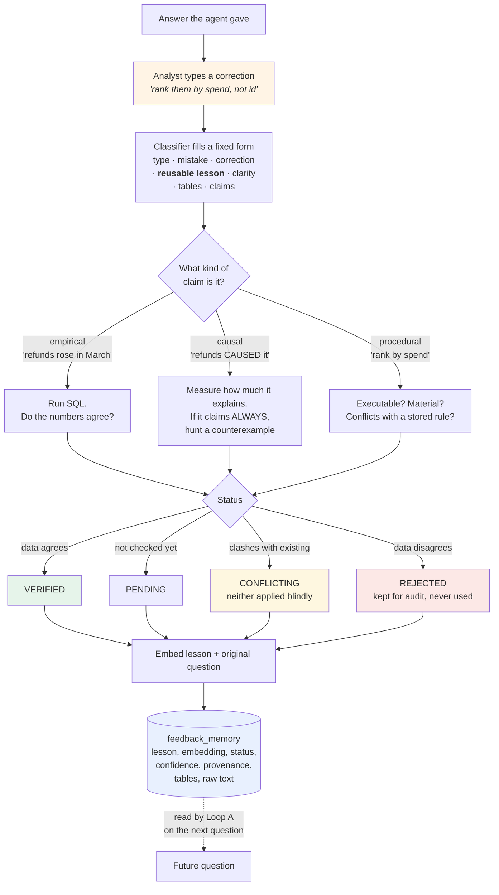
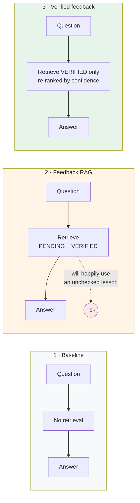

# How the agent uses memory

Two loops. The agent never changes; only what is in its prompt changes.

## Loop A — answering a question (read from memory)

## Loop B — receiving a correction (write to memory)

## The three systems being compared

All three run the identical pipeline. Only the retrieval filter differs, which
is what makes the comparison meaningful — any score difference comes from the
memory, not from a prompt someone edited.

## What the experiment tests

A deliberately false lesson is injected: *"revenue declines are always caused
by refunds."*

- System 2 has no way to reject it, so it should adopt it and get worse.
- System 3 should reject it, because July 2026 is a month where revenue fell
  while refunds stayed flat — one counterexample is enough to refute a claim
  containing "always".

That gap between systems 2 and 3 is the result the project exists to produce.
